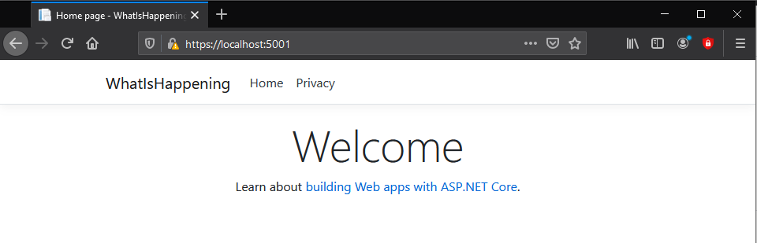
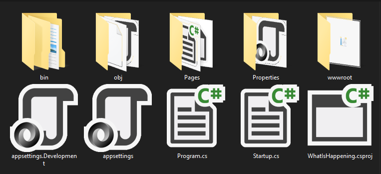

# Title: .NET on the Web

- Repository: `net-on-the-web`
- Type of Challenge: `Learning Challenge`
- Duration: `<1 day`
- Deployment strategy : `NA`
- Team challenge : `solo`

## Learning objectives
- Learn how to start a webApp project.
- Explore the generated folder structure.
- Adding extra pages.
- Adding a Model

## The Mission
Create a .NET webApp and (try to) understand everything that is generated for you.
We will also try to add some extra pages and a Model.


### Create Web App

First of all in the terminal use the command to start a new WebApp.

``dotnet new webapp -o NameOfYourProject`` 

Then navigate in this folder and run it! (the ``--watch`` parameter is to watch for file changes.)

``dotnet run --watch``

When you open up your browser you should see this.




###Explore the generated files and folders


#### Pages folder

Contains Razor pages and supporting files. Each Razor page is a pair of files:

    A .cshtml file that has HTML markup with C# code using Razor syntax.
    A .cshtml.cs file that has C# code that handles page events.

Supporting files have names that begin with an underscore. For example, the _Layout.cshtml file configures UI elements common to all pages. This file sets up the navigation menu at the top of the page and the copyright notice at the bottom of the page. For more information, see [Layout in ASP.NET Core.](https://docs.microsoft.com/en-us/aspnet/core/mvc/views/layout?view=aspnetcore-5.0)

#### wwwroot folder

Contains static assets, like HTML files, JavaScript files, and CSS files. For more information, see [Static files in ASP.NET Core.](https://docs.microsoft.com/en-us/aspnet/core/fundamentals/static-files?view=aspnetcore-5.0)

#### appsettings.json

Contains configuration data, like connection strings. For more information, see [Configuration in ASP.NET Core.](https://docs.microsoft.com/en-us/aspnet/core/fundamentals/configuration/?view=aspnetcore-5.0)

#### Program.cs

Contains the entry point for the app. For more information, see [.NET Generic Host in ASP.NET Core.](https://docs.microsoft.com/en-us/aspnet/core/fundamentals/host/generic-host?view=aspnetcore-5.0)

#### Startup.cs

Contains code that configures app behavior. For more information, see [App startup in ASP.NET Core.](https://docs.microsoft.com/en-us/aspnet/core/fundamentals/startup?view=aspnetcore-5.0)

#### bin & obj folder

In “obj” folder, we have compiled files for each source code file and in “bin” folder, we have a single unit which links all individually compiled code files.


### First things first

Our goal now is to make A model and display it in the view.

#### Creating a Razor Page
First we need a view ofcourse, so how do make a view?

    dotnet new page --name HelloWeb --namespace HelloWorld.Pages --output Pages

The command generates a Razor Page with a PageModel file. You need to specify the namespace otherwise the default value of MyApp.Namespace is used. Likewise, if you don't specify the Pages directory as the output location, the page will be generated in the folder where the command is executed.

#### Passing data

Lets say your page is called 'HelloWeb' First we declare the string we want to pass ````public string Message { get; set; } = "In page model: ";```` . Then in the view make sure the PageModel is included like so: 
````
    @page
    @model HelloWebModel

````
Now we can do this:  ``<p>@Model.Message the time is @DateTime.Now</p>`` This will show us the expected result.


PS: What is This @model vs. @Model ???


We declare the current page as Model so we can access the public variables in the backend. (or razor magic you decide ;) )

### Creating the Model

To create (and keep) structure in our project make a folder called "Models", this will help you A LOT in the future. In this folder make a new class -> HINT: Don't forget those awesome context menus of your IDE ...

Let's make a Student with the following properties -> Id, Name, ClassId.

To now include and use this model on your 'HelloWeb' view: 
 - Add it to the code behind -> ``using webtime.Models;``
 - Create an object -> ``public Student Sicco = new Student();``
 - Include the object in the view -> Automatically done, since you included it in the PageModel and the view is based on this model.
 - Display the data -> 
````
    <p>@Model.Sicco.Name</p>
    <p>@Model.Sicco.Id</p>
    <p>@Model.Sicco.ClassId</p>
````
 
 
## TODO: YOUR TASKS
You got the basics of creating pages, models AND making them work together!

Now you have to figure a few things out:

     - Instead of one Student I want multiple students, show them in an nice list
     - I don't want to fill in the URL make sure your nav is up to date
     - I would love to see some teachers and class rooms make these Models, Views and show them.
     - NICE TO HAVE -> Make a relation between these Models


